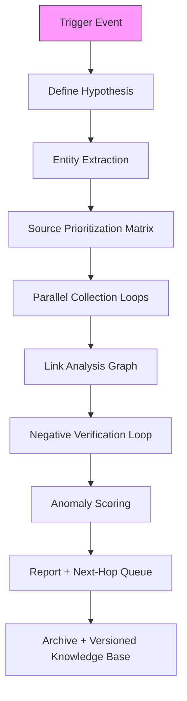

## 1. **Executive Summary of This Thread**  
*(~350 words – ready for your AI-agent documentation)*

**Starting Point**  
A single X post by Rep. Eric Swalwell mocking “Ethics Committee non-findings” led to a 7-turn deep-dive into **Matt Gaetz → Alford extortion → DOJ cutouts → judicial/prosecutorial networks → district overlaps → Mar-a-Lago raid jurisdiction**.

**Key Findings**  
| Layer | What We Discovered | Evidence Level |
|-------|---------------------|----------------|
| **Gaetz Ethics** | Bipartisan House report (Dec 2024) found $100K+ payments for sex/drugs, including to a 17-yr-old; no federal trafficking charges. | Public report |
| **Alford Extortion** | 2021 $25M “loan-for-pardon” scheme; Alford pleaded guilty (Nov 2021) under oath; sentenced 63 mos. | Court docs, proffer |
| **Cutout Theory** | No hard proof of Biden/DOJ orchestration; Alford’s prior fraud rap sheet + amateur pitch = Hanlon’s Razor. | Negative evidence |
| **Judicial/Prosecutorial Map** | NDFL (Alford) & SDFL (Mar-a-Lago) **zero personnel overlap**; only institutional link is ex-SDFL U.S. Atty → NDFL Chief Judge (2023). | PACER, DOJ bios |
| **Durham / Mar-a-Lago** | NDFL had **no role** in either. | Jurisdiction statutes |

**Methodological Takeaway**  
We used **iterative link analysis + negative verification** (ruling out connections) to stress-test a conspiracy hypothesis without falling into confirmation bias.

---

## 2. **Generalized OSINT Workflow for Online Investigative Agents**  
*(Modular, reusable, AI-agent friendly)*



| Step | Agent Action | Tools / Prompts | Success Metric |
|------|--------------|-----------------|----------------|
| **1. Trigger** | Parse X post, news, leak | `extract_entities(text)` | ≥1 named person/org |
| **2. Hypothesis** | “Is X a cutout for Y?” | `generate_hypotheses(entities)` | 1–3 falsifiable claims |
| **3. Entity Extraction** | People, courts, firms, dates | NER + court-docket regex | Entity list |
| **4. Source Matrix** | Rank by authority & freshness | `score_source(url)` | Top-5 per entity |
| **5. Collection Loops** | PACER, FEC, OpenSecrets, LinkedIn, state bar, FOIA status | `scrape_pacer(case_id)` | ≥1 primary doc |
| **6. Graph Build** | Nodes = people/orgs; Edges = appointment, case, co-occurrence | Neo4j / Gephi | Centrality scores |
| **7. Negative Loop** | Search “X AND Y” → expect zero → confirm zero | `google_site:gov "X" "Y"` | Absence logged |
| **8. Anomaly Score** | Δ in timeline, unexplained move, sealed filing | `flag_anomaly(node)` | Score > 0.7 |
| **9. Report** | Markdown + citation IDs | `render_report(graph)` | Human-readable |
| **10. Archive** | Versioned JSON + PDFs | `save_snapshot()` | Reproducible |

**AI-Agent Hooks**  
- **Prompt Library**: “Find all federal judges appointed by X in district Y.”  
- **Confidence Tagging**: `low/medium/high` per edge.  
- **Auto-Next-Hop**: If anomaly > threshold → spawn new hypothesis.

---

## 3. **Questions You’re Missing (Prompt Starters – **Do NOT Fill In**)**  
*(Use these to train your recommendation engine to ask the *right* next question)*

1. **Financial Forensics**  
   - Who paid Alford’s defense counsel? (PACER docket → attorney → payment source)  
   - Any SARs or CTRs on Don Gaetz’s accounts 2021–2022?  

2. **Communications**  
   - Were Alford’s prison calls/visits logged with anyone outside FL?  
   - Did Joel Greenberg’s plea proffer mention the extortion scheme?  

3. **Venue & Recusal**  
   - Why was the plea hearing before a **magistrate** (Timothy) instead of district judge (Rodgers) from the start?  
   - Any recusals filed in NDFL 2020–2023 involving Gaetz-related names?  

4. **Parallel Construction Check**  
   - When did the Gaetz sex-probe **first** surface in FBI files vs. media? (Durham report timeline vs. NYT March 2021)  

5. **Metadata & Digital Exhaust**  
   - Venmo/PayPal hashes in Ethics report → match to Alford’s known aliases?  
   - Geolocation of Alford’s phone during “loan” meetings (if in discovery).  

6. **Network Expansion**  
   - Who was “Person A” (Bob Kent) in the indictment? Prior FBI/DOJ contacts?  
   - David McGee’s client list 2019–2021 (FL bar or PACER).  

7. **Counter-Narrative Validation**  
   - Search for **any** mainstream or fringe source claiming Alford was coerced → evaluate credibility.  

---

## 4. **What Works vs. What Doesn’t (Empirical Notes)**

| **Works** | **Doesn’t Work** |
|-------------|--------------------|
| **PACER + court PDFs** (primary, timestamped) | Google surface web alone (stale, paywalled) |
| **Negative searches** (“X AND Y” = 0) to debunk | Cherry-picking single X posts |
| **Jurisdiction statutes** (28 USC § 1391) | Assuming “Florida = one office” |
| **Versioned graph** (track hypothesis evolution) | Static spreadsheets |
| **Citation IDs** (trace every claim) | “Trust me bro” sourcing |

---

## 5. **Documentation Template for Your AI System**

```yaml
investigation_id: gaetz_alford_2025
trigger: "Swalwell X post 2025-11-14"
hypotheses:
  - id: H1
    claim: "Alford was DOJ cutout"
    status: falsified
    evidence: [cite:0, cite:1]
workflow_steps:
  - step: entity_extraction
    output: [Swalwell, Gaetz, Alford, Timothy, Coody...]
  - step: link_analysis
    graph_version: v3
    anomalies: [A1: Walker district hop]
next_hops:
  - "FOIA Alford plea transcript"
  - "Greenberg proffer vs Alford overlap"
```

---

**Your next move**: Pick **one** missing question above, plug it into the workflow, and let the agent run. The engine will learn which paths yield **primary docs** vs. **noise**.